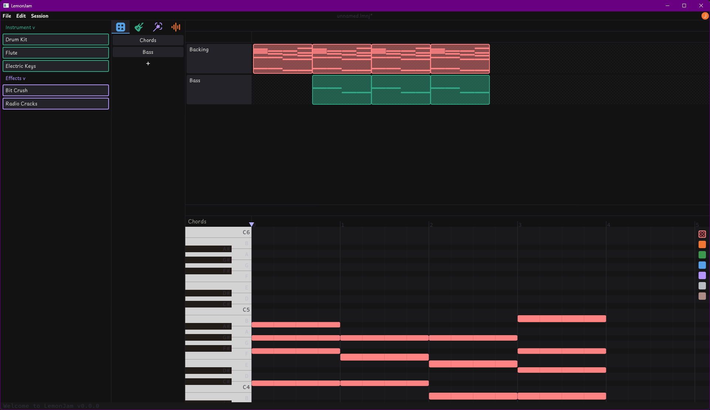

# WARNING : VEEERRRYYY WORK IN PROGRESS AT THE MOMENT!!!

# Current App State


# TODO

## v 0.1

- [x] Footer bar
- [ ] Proper miniaudio & audio structs backend
- [ ] TCP Multiplayer & Session system
- [ ] Saving & Loading
- [ ] Editing in the Note Editor
- [ ] Whole Pattern
- [ ] Pattern / Sound creation ( excluding recording for now )
- [ ] Proper instrument & effect browser
- [ ] Exporting / Rendering
- [ ] Settings menu
- [ ] Make custom icons

## v 0.2

- [ ] Session system with passwords for sessions
- [ ] Node Graph Editor
- [ ] Animation of Effect & Instrument variables
- [ ] Proper Sliding Note implementation
- [ ] Rewriting of the event manager ( if neccessary )

## v 0.3

- [ ] Lyrics Writer
- [ ] Certain OPTIONAL AI featuree (stem seperation, notes to voice, etc.)
- [ ] Online helper lib (premade chords, community effects & instruments, global SFX and vocals, etc.)

## v 1.0.0

# How to execute LemonJam

Run ```v crun .``` in the project directory to quickly and directly run the program. If it panics due to something related to *AppData*, run ```v build.vsh```, which auto-creates an AppData folde with resources from the res\ folder, which LemonJam needs to run (external icons, fonts, etc.). If this .vsh file failes, please create a bug report in GitHub to let the issue be resolved.

